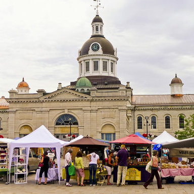

# Cultivating creative public spaces

The City of Kingston challenges students to think outside the box 
and develop dynamic public spaces in under-utilized venues. 
Equipped with information and creativity, 
inspired students should submit a proposal 
to re-imagine one of the Kingston locations listed below and make it home to an exciting, 
engaging and people-friendly experience.

 

**Choose one of the following locations to re-imagine:**
* Amphitheatre in Springer Market Square
* Ontario Street – closed from Brock to Clarence. 
* Portsmouth Olympic Harbour

-------------------------------------------------

## Resources

* Explore Kingston with our interactive mapping system, 
[KMaps](https://www.cityofkingston.ca/explore/maps/kmaps)
* Overview of locations to be re-imagined and potential ideas ([link](https://www.dropbox.com/s/50i7imo76ffi3iu/Public%20Space.ppsx?dl=0))


